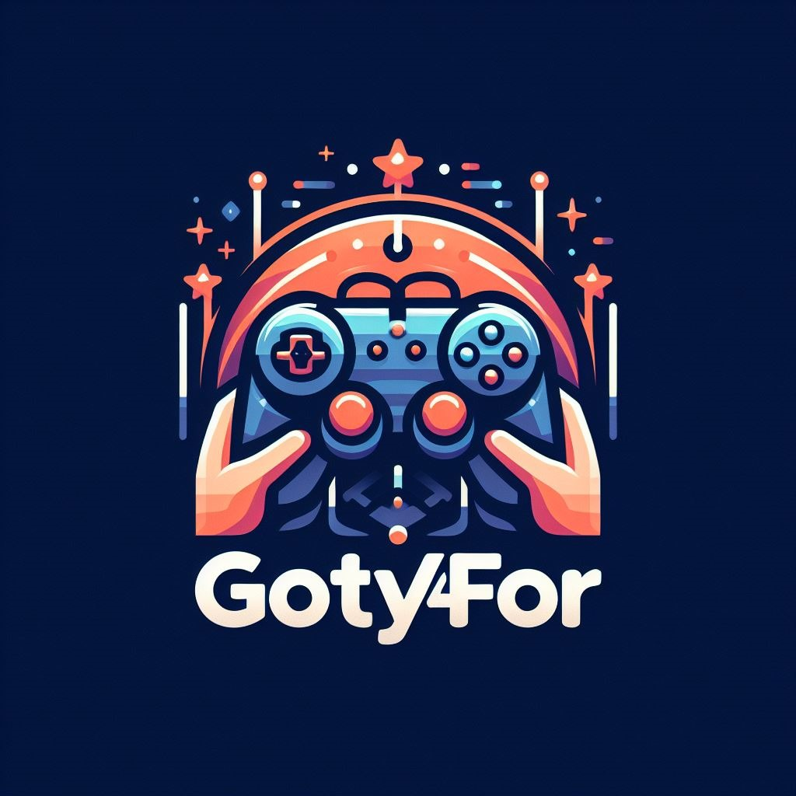

# biblioteca_game:

# Instrução do deploy do docker;
Copia os Arquivo Dockerfile e docker-compose.yml para dentro do diretorio de sua preferencia, sugiro criar um separado para o projeto

* dentro do diretorio e já com os dois arquivos nele (Dockerfile e docker-compose) executar os seguintes comandos;
    * docker-compose down

    * docker-compose build

    * docker-compose up -d

* Acessa o container com o seguinte comando;
  * docker exec -it biblioteca-game /bin/bash

* Dentro do container acessa o diretorio /var/www e dar o git clone;
    * cd /var/www
    * git clone https://github.com/psignori/biblioteca_game.git

* Saia do container e entre dentro da pasta que foi mapeada para dar as próximas permissões
  * permissão para poder salvar arquivos dentro do /biblioteca_game
      * sudo chmod 777 -Rf .

## Problemas comum

## Problemas que estavam ocorrendo antes mas que não estão mais ocorrendo, só para documentar
  * Dar permissões ao git;
    * git config --global --add safe.directory /var/www/biblioteca_game
    * git config --global user.email "you@example.com"
    * git config --global user.name "Your Name"

  * Criar chave pública na seguinte url: https://github.com/settings/tokens
    * ela vai gerar uma chave parecida com essa aq: TESTECqYY1ZI416nTESTE2OoptqjZ9cuK1TESTE sem os testes claro.

  * dentro do repositorio que foi clonado executar o seguinte comando trocando somente a chave na url:
    * git remote set-url origin https://sua_chave_aq@github.com/psignori/biblioteca_game.git